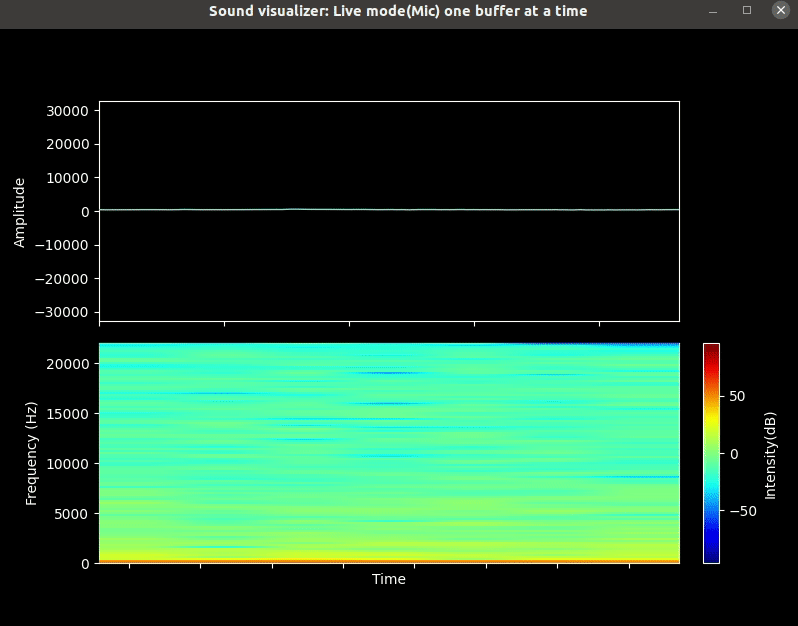
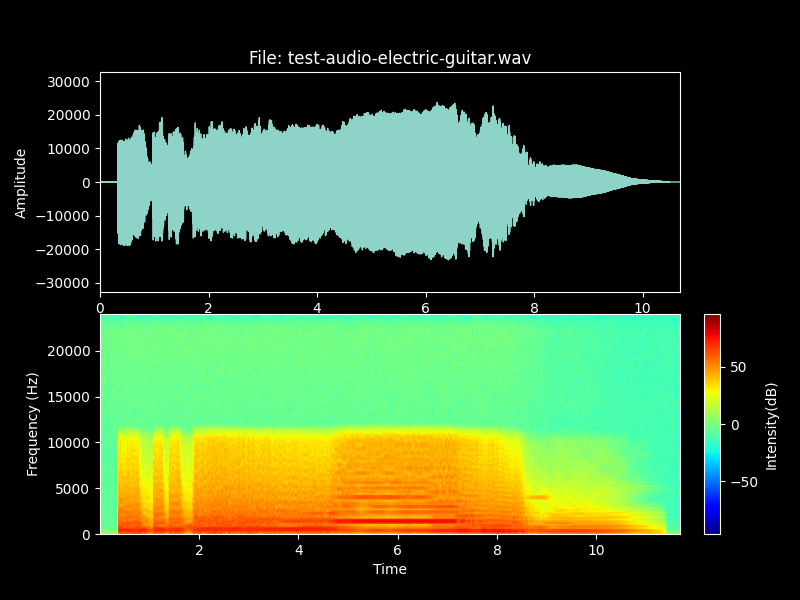

# About
A repo to play around with audio and DSP in general.

## sound_visualizer.py:
A script to plot time domain and frequency domain(spectrogram) graphs of audio signals.
- Supported input:
  - Real time mic audio
  - Data from a `16bit` WAV audio file
- Realt time output examples (scrolling mode and one buffer at a time mode)

 

## :hammer_and_wrench:Setup/ Preparation
1) Make sure you have
```bash
sudo apt-get install python3.9-tk # for matplotlib GUI backend
sudo apt-get install python3.9-dev # needed to pip install PyAudio
sudo apt-get install portaudio19-dev python-pyaudio # Might also be needed for PyAudio
```
2) Setup the pipenv as follows
```bash
pipenv install --ignore-pipfile --python 3.9
pipenv shell
```

## :rocket: Usage examples

#### Plot mic input in real time with time scrolling
This is a default mode. No flags need to be specified.
```bash
python sound_visualizer.py
```

#### Plot mic input in real time without scrolling
Each animation frame in the plots will represent one data buffer
```bash
python sound_visualizer.py -b
```

#### Plot a 16-bit wav file
Each animation frame in the plots will represent one data buffer
```bash
python sound_visualizer.py -f <filename>
```


